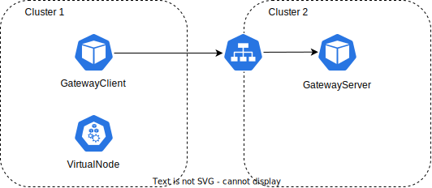

# Liqo Developer Tutorial: Add a new tunneling protocol for inter-cluster networking

This branch introduces a generic external-networking scaffold to simplify the integration of additional tunneling technologies [in Liqo](https://liqo.io/).

At the time of writing, Liqo only supports WireGuard as the tunneling technology for [inter-cluster networking](https://docs.liqo.io/en/v1.1.2/advanced/peering/inter-cluster-network.html) (also referred to as 'external networking'). This guide is intended for developers who wish to integrate a new tunneling technology into Liqo.
Note that the `liqoctl` integration will not be covered by this guide.

We recommend to follow this guide and check the mentioned resources in a basic Liqo deployment, like the [multi-cluster deployment mentioned here](https://docs.liqo.io/en/v1.1.2/examples/replicated-deployments.html).

Regarding this topic, Liqo design separates:

* **Protocol-agnostic logic**: gateway process bootstrap, startup orchestration, shared connection health checks, and status updates. This logic is already implemented and should be reused as much as possible.
* **Protocol-specific logic**: tunnel setup/maintenance, protocol CRDs, protocol-specific controllers, runtime behavior. This part is totally based on the protocol, hence it needs to be implemented almost entirely.

## Table of contents

* [Architecture overview and control flow](#architecture-overview-and-control-flow)
  * [Gateway Pod architecture](#gateway-pod-architecture)
  * [End-to-end flow of the gateways creation (declarative to runtime)](#end-to-end-flow-of-the-gateways-creation-declarative-to-runtime)
* [Implementation walkthrough](#implementation-walkthrough)
  * [1. Create and generate protocol CRDs](#1-create-and-generate-protocol-crds)
  * [2. Implement generic external-network controllers for your protocol](#2-implement-generic-external-network-controllers-for-your-protocol)
    * [2.1 Implement the protocol interface wrappers](#21-implement-the-protocol-interface-wrappers)
    * [2.2 Implement protocol options structs (OptionsServer and OptionsClient)](#22-implement-protocol-options-structs-optionsserver-and-optionsclient)
    * [2.3 Extend builder setup when needed](#23-extend-builder-setup-when-needed)
    * [2.4 Detailed responsibilities of generic server/client reconcilers](#24-detailed-responsibilities-of-generic-serverclient-reconcilers)
  * [3. Start protocol controllers from controller-manager](#3-start-protocol-controllers-from-controller-manager)
  * [4. RBAC for new protocol controllers](#4-rbac-for-new-protocol-controllers)
  * [5. Implement the protocol container entrypoint](#5-implement-the-protocol-container-entrypoint)
    * [Runtime and startup synchronization model](#runtime-and-startup-synchronization-model)
  * [6. Connection ownership model](#6-connection-ownership-model)
  * [7. Container naming and leader election caveat](#7-container-naming-and-leader-election-caveat)
* [Suggested validation flow for a new protocol](#suggested-validation-flow-for-a-new-protocol)
* [Scope of this tutorial](#scope-of-this-tutorial)

## Architecture overview and control flow

At a high level, Liqo, when regarding the inter-cluster networking [(described here in the official docs)](https://docs.liqo.io/en/v1.1.2/advanced/peering/inter-cluster-network.html) is easier to understand as two responsibility layers:

* **Control layer (controller-manager)**: translates desired state (defined by the `GatewayServer`/`GatewayClient` CRDs) into Kubernetes resources.
* **Data-path runtime layer (gateway pod)**: runs protocol containers, orchestrates startup order, and reports connection health.

### Gateway Pod architecture
The gateway pod is the data-path runtime layer component that connects a local cluster node to the remote gateway side.
Its responsibilities are:

* handle **external networking** through the tunnel protocol
* handle **internal networking** using Geneve encapsulation
* forward traffic and apply routing/NAT decisions between the two networking planes

In the default architecture, the gateway pod has three containers:

<div style="background-color: white; padding: 20px; display: inline-block;">
  
</div>

1. **Geneve container**:
  * creates and manages Geneve-related interfaces
  * provides internal overlay connectivity handling
  * Reference file: [cmd/gateway/geneve/main.go](cmd/gateway/geneve/main.go)
2. **Gateway container**:
  * orchestrates shared runtime networking behavior
  * forwards traffic, applies routes, and manages networking control-plane resources
  * coordinates startup synchronization across gateway pod containers
  * Reference file: [cmd/gateway/main.go](cmd/gateway/main.go)
3. **WireGuard container**:
  * creates and manages WireGuard interfaces and session state
  * provides external tunnel connectivity
  * Reference file: [cmd/gateway/wireguard/main.go](cmd/gateway/wireguard/main.go)

Why this matters for a new protocol:

* to introduce a new tunneling technology, you must implement a protocol runtime container that replaces the WireGuard container role
* Geneve and Gateway containers remain part of the default architecture, while the protocol-specific container is the replaceable external-tunnel component

### End-to-end flow of the gateways creation (declarative to runtime)

Liqo supports a declarative model ([described here](https://docs.liqo.io/en/v1.1.2/advanced/peering/peering-via-cr.html)) where users define intent, and controllers create runtime resources.

**Note**: the client/server distinction here applies only to the tunnel termination processes. Within Liqo, roles are defined as **Provider** and **Consumer**, and both can function as either client or server in this specific context.

<div align="center" style="background-color: white; padding: 20px; display: inline-block;">
  
</div>

What happens at gateway creation:

1. On cluster A, the user creates a `GatewayClient` resource.
2. On cluster B, the user creates a `GatewayServer` resource.
3. Both these CRs carry protocol-independent data (for example endpoint info, port configuration) and **references the protocol template to use**:
  * `GatewayServer` -> `<Protocol>GatewayServerTemplate`
  * `GatewayClient` -> `<Protocol>GatewayClientTemplate`
4. **Templates** define the concrete resources to instantiate.
(`Deployment` template, server-side `Service` template, and protocol-specific knobs.)
5. Generic + protocol-specific controllers **fill template data** using `GatewayServer`/`GatewayClient` values and create:
  * `<protocol>GatewayServer`
  * `<protocol>GatewayClient`
6. Runtime containers in the gateway Pod are then deployed and they configure the tunnel implementation.
7. After the tunnel is successfully established, a controller running inside the protocol-specific container creates the `Connection CR` with initial status `Connecting`.
8. [Connection checker controller](pkg/gateway/connection/connections_controller.go) (which runs inside the `gateway` container) verifies reachability and updates runtime status/latency (`Connected`/`ConnectionError`).

This flow can be easily replicated by following [this guide provided in the Liqo docs](https://docs.liqo.io/en/v1.1.2/advanced/peering/peering-via-cr.html).


## Implementation walkthrough

This section describes the practical steps to implement a new tunneling protocol in Liqo.

### 1. Create and generate protocol CRDs

You need four new CRDs:

* `<protocol>GatewayClient`
* `<protocol>GatewayClientTemplate`
* `<protocol>GatewayServer`
* `<protocol>GatewayServerTemplate`

Files to update:

* [apis/networking/v1beta1](apis/networking/v1beta1)/&lt;protocol&gt;gatewayclient_types.go
* [apis/networking/v1beta1](apis/networking/v1beta1)/&lt;protocol&gt;gatewayclienttemplate_types.go
* [apis/networking/v1beta1](apis/networking/v1beta1)/&lt;protocol&gt;gatewayserver_types.go
* [apis/networking/v1beta1](apis/networking/v1beta1)/&lt;protocol&gt;gatewayservertemplate_types.go
* [apis/networking/v1beta1/groupversion_info.go](apis/networking/v1beta1/groupversion_info.go) (if you need to register additional types manually)

Responsibility of these CRDs:

* Define protocol API surface and validation schema.
* Define `Spec` and `Status` fields used by protocol and generic controllers.

Recommended mental model for the four resources:

* `<protocol>GatewayServerTemplate` and `<protocol>GatewayClientTemplate` are **blueprints**:
  * they define the skeleton used by the rendering function ([code here](pkg/liqo-controller-manager/networking/external-network/utils/template.go))
  * they contain both fixed/default protocol knobs and placeholders/fields that will be resolved from the specific peering context.
    * [Example of the Wireguard server default template](tutorial-content/wireguardGwServerTemplate.yaml). 
  * dynamic values are derived from the corresponding `GatewayServer`/`GatewayClient` applied to the cluster, for example **endpoint addresses**, **ports**, **service type**, and other connectivity parameters.
    * These values are easy to spot in the templates, as they are surrounded by `{{ }}`. For a practical example check the `Deployment`[ at line 34](tutorial-content/wireguardGwServerTemplate.yaml), the `Service`[ at line 192](tutorial-content/wireguardGwServerTemplate.yaml) and the reference to a `Secret` [at line 190](tutorial-content/wireguardGwServerTemplate.yaml).
* `<protocol>GatewayServer` and `<protocol>GatewayClient` are **concrete rendered resources**:
  * they should contain the effective values that will actually be reconciled and consumed at runtime
  * they represent the final desired state for that specific peering pair
  * they are managed as normal CRDs by the protocol controllers (status updates, endpoint updates, secret handling, etc.)
  * they are the "filled" version of the template.

In practice, this means:

* Template CRDs should expose enough structure for rendering to produce valid concrete resources in all supported scenarios.
* Concrete CRDs should include all runtime-ready objects and parameters needed by the gateway pod.
* A `Deployment` is always expected in concrete server/client resources.
* A `Service` is usually required on the server side (externally reachable endpoint).
* A `Secret` is optional and protocol-dependent (for example keys/certificates/tokens), but when needed it should be explicitly modeled and reconciled.
* Additional protocol-specific fields can be added and should be handled by the corresponding protocol controller logic described in the next sections.

After adding API types and kubebuilder markers, regenerate manifests with Makefile targets already available in this repository:

```bash
make manifests
make rbacs
make generate
```

Notes:

* `make manifests` runs `controller-gen` for CRDs.
* `make rbacs` regenerates RBAC manifests from kubebuilder RBAC markers.
* `make generate` runs the full generation pipeline (`generate-groups`, `rbacs`, `manifests`, `fmt`).

### 2. Implement generic external-network controllers for your protocol

The `GenericGatewayServer` and `GenericGatewayClient` controllers are the integration point for protocol-specific resources.

Conceptually:

* The generic controller flow handles shared reconciliation mechanics.
* Protocol callbacks and protocol CR wrappers provide protocol-specific behavior.

Files to update:

* [pkg/liqo-controller-manager/networking/external-network/generic/genericgatewayclient_controller.go](pkg/liqo-controller-manager/networking/external-network/generic/genericgatewayclient_controller.go)
* [pkg/liqo-controller-manager/networking/external-network/generic/genericgatewayserver_controller.go](pkg/liqo-controller-manager/networking/external-network/generic/genericgatewayserver_controller.go)
* [pkg/liqo-controller-manager/networking/external-network](pkg/liqo-controller-manager/networking/external-network)/&lt;protocol&gt;/ (new package with protocol wiring and helpers, if needed)

Reference implementation:

* [pkg/liqo-controller-manager/networking/external-network/wireguard/wggatewayclient_controller.go](pkg/liqo-controller-manager/networking/external-network/wireguard/wggatewayclient_controller.go)
* [pkg/liqo-controller-manager/networking/external-network/wireguard/wggatewayserver_controller.go](pkg/liqo-controller-manager/networking/external-network/wireguard/wggatewayserver_controller.go)

Responsibility of this module:

* Translate desired state (`GatewayClient` / `GatewayServer`) into protocol-specific resources.
* Connect protocol behavior to the generic reconciliation framework through interfaces and callbacks.
* Implement specific reconciliation logic based on the specific protocol used.

#### 2.1 Implement the protocol interface wrappers

Implement the protocol interfaces (`<protocol>GatewayServer` and `<protocol>GatewayClient`) using getters/setters mapped to your CR structure.

Typical methods expose:

* deployment/service templates
* metrics settings
* secret references
* endpoint status fields
* internal endpoint status fields

This is similar to the WireGuard pattern where wrapper methods just map generic controller expectations to protocol CR fields.

**Important Note** : These methods represent the basic interfaces required for the tunnel to operate. Some resources are strictly mandatory: for instance, a `Deployment` is always needed for the gateway pod, along with a `Service` to make that pod reachable (on server side). Other methods expose highly probable requirements, such as a Secret for handling security parameters.

However, specific needs vary depending on the protocol. Take WireGuard as an example ([here]()): to handle security, its implementation uses a `Secret` to store the local cluster's private and public keys, alongside a custom CRD (of type `PublicKey`) that stores the remote cluster's public key.

Ultimately, the exact implementation and the design of the security model depend on the requirements of the specific protocol and are left entirely to the discretion of the developer implementing the CRD.

<details>

  <summary> Expand to see an example of the wrappers </summary>:

```go
// Assuming the CRD defined is called ProtocolGatewayServer, some basic wrappers are these:


// Extracts the Deployment of the GatewayPod from the <protocol>GatewayServer
func (p *ProtocolGatewayServer) GetDeploymentTemplate() *appsv1.Deployment {
  return &p.Spec.Deployment
}

// Extracts the Service from <protocol>GatewayServer to expose the deployment of the Gateway Pod mentioned above (if necessary)
func (p *ProtocolGatewayServer) GetServiceTemplate() *corev1.Service {
  return &p.Spec.Service
}

// Extracts the Secret Reference to the Secret storing security parameters to configure the runtime (if necessary).
func (p *ProtocolGatewayServer) GetSecretRef() corev1.LocalObjectReference {
  return p.Spec.SecretRef
}

// Writes the status of the Endpoint onto the <protocol>GatewayServer resource.
func (p *ProtocolGatewayServer) SetEndpointStatus(endpoint *networkingv1beta1.Endpoint) {
  p.Status.Endpoint = endpoint
}
```

</details>


#### 2.2 Implement protocol options structs (`OptionsServer` and `OptionsClient`)

These structs contain callback functions that perform protocol-specific actions, such as:

* ensuring key/certificate secrets
* validating protocol prerequisites
* reconciling protocol side resources
* updating protocol endpoint/runtime configuration

A practical pattern is to place callback implementations in protocol utility files and only wire functions in the controller setup code, to keep reconcilers small and readable.

Callback contract details (recommended to document in your protocol package):

| Callback field | Used by | Mandatory | Typical purpose |
|---|---|---|---|
| `NewResource` | Client + Server | Yes | Return empty protocol CR object implementing `GenericGwClient`/`GenericGwServer`. |
| `EnsureSecret` | Client + Server | Optional | Generate protocol secret material when `spec.secretRef` is empty. |
| `CheckExistingSecret` | Client + Server | Optional | Validate user-provided secret and enforce labels/ownership if needed. |
| `GetSecretRefStatus` | Client + Server | Optional | Extract computed status reference to protocol secret. |
| `HandleSecretRefStatus` | Client + Server | Optional | Write/update status fields tied to protocol secret lifecycle. |
| `CustomBuilderSetup` | Client + Server | Optional | Add protocol-specific watches/predicates/enqueuers to controller builder. |

Execution timing:

* Secret callbacks are designed to run during reconciliation, before deployment/service enforcement.
* In the current scaffold, secret callback blocks are intentionally present as extension points and may be commented/disabled until explicitly enabled by your protocol integration.
* Status-related callback writes should happen before final `Status().Update(...)` in the reconciler deferred section.
* `CustomBuilderSetup` is applied in `SetupWithManager(...)` at controller registration time.


Files to update:

* [pkg/liqo-controller-manager/networking/external-network](pkg/liqo-controller-manager/networking/external-network)/&lt;protocol&gt;/ (new files, for example `options.go` and `utils.go`)
* [pkg/liqo-controller-manager/networking/external-network/generic/genericgatewayclient_controller.go](pkg/liqo-controller-manager/networking/external-network/generic/genericgatewayclient_controller.go) (options wiring)
* [pkg/liqo-controller-manager/networking/external-network/generic/genericgatewayserver_controller.go](pkg/liqo-controller-manager/networking/external-network/generic/genericgatewayserver_controller.go) (options wiring)

**Note**: this part is highly dependant on the chosen protocol and how it works, hence this part should be used more like a guideline instead of an actual tutorial. 

#### 2.3 Extend builder setup when needed

When your protocol needs additional watches, add them through a protocol-specific custom builder setup hook.

Examples of extra watches:

* Pods (runtime readiness changes)
* Secrets (keys/certs/config)
* ClusterRoleBinding or other permissions-related resources

Files to update:

* [pkg/liqo-controller-manager/networking/external-network](pkg/liqo-controller-manager/networking/external-network)/&lt;protocol&gt;/... (enqueuers and predicates)
* [pkg/liqo-controller-manager/networking/external-network/generic/genericgatewayclient_controller.go](pkg/liqo-controller-manager/networking/external-network/generic/genericgatewayclient_controller.go) (custom builder hook wiring)
* [pkg/liqo-controller-manager/networking/external-network/generic/genericgatewayserver_controller.go](pkg/liqo-controller-manager/networking/external-network/generic/genericgatewayserver_controller.go) (custom builder hook wiring)


<details>
  <summary>Example of the CustomBuilder:</summary>

```go
CustomBuilderSetup: func(b *builder.Builder) *builder.Builder {
  return b.
    Watches(&corev1.Pod{}, handler.EnqueueRequestsFromMapFunc(podEnqueuer)).
    Watches(&rbacv1.ClusterRoleBinding{}, handler.EnqueueRequestsFromMapFunc(clusterRoleBindingEnqueuer)).
    Watches(&corev1.Secret{}, handler.EnqueueRequestsFromMapFunc(secretEnqueuer),
      builder.WithPredicates(filterProtocolSecretsPredicate()))
}
```
</details>

#### 2.4 Detailed responsibilities of generic server/client reconcilers

Both reconcilers share the same reconciliation skeleton:

1. Load protocol CR through `NewResource()`.
2. Handle deletion/finalizer cleanup (`ClusterRoleBinding` cleanup).
3. Ensure ServiceAccount + ClusterRoleBinding for gateway workload identity.
4. Run protocol callback hooks (secret lifecycle and optional custom logic), if enabled in your integration path.
5. Enforce workload resources.
6. Update status and emit events.

Client reconciler specifics (`genericgatewayclient_controller.go`):

* Enforces `Deployment` and optional metrics.
* Updates internal endpoint status used by runtime connectivity.
* Supports protocol-specific watches via `CustomBuilderSetup`.

Server reconciler specifics (`genericgatewayserver_controller.go`):

* Enforces `Deployment`, `Service`, and optional metrics.
* Updates both public endpoint status and internal endpoint status.
* Applies the same callback model as client reconciler.

Why this split matters:

* Client and server roles have different endpoint semantics (server has externally reachable service endpoint).
* Keeping shared behavior in generic reconcilers avoids protocol duplication, while callbacks preserve protocol flexibility.

### 3. Start protocol controllers from controller-manager

Defining protocol controllers is not enough: they must be instantiated and registered in the controller manager startup path, this means that the `liqo-controller-manager` needs to be rebuilt.

For each protocol controller:

1. Create the reconciler instance.
2. Call `SetupWithManager(...)`.
3. Ensure required options/callbacks are correctly injected.

Also, the `liqo-controller-manager` needs to be aware of the new gateway CRDs installed, so make sure to **update the args** called `--gateway-server-resources` and `--gateway-client-resources` , in its `Deployment`. It can be done by editing the helm chart values file before installing Liqo or by manually editing the `Deployment`.

Note that all the changes done to the `values.yaml` file are enforced only when Liqo is installed using the `--local-chart-path` argument.

Files to update:

* [cmd/liqo-controller-manager/modules/networking.go](cmd/liqo-controller-manager/modules/networking.go)
* [deployments/liqo/values.yaml](deployments/liqo/values.yaml#L62-L68)

Reference implementation:

* [cmd/liqo-controller-manager/modules/networking.go](cmd/liqo-controller-manager/modules/networking.go) (WireGuard controller startup wiring)

### 4. RBAC for new protocol controllers

When you add a new controller in the controller-manager, permissions should be declared through kubebuilder RBAC markers in the controller code.

Recommended workflow:

1. Add or update `+kubebuilder:rbac` markers in the new/updated controller files.
2. Regenerate RBAC manifests with `make rbacs`.
3. Redeploy/upgrade Liqo so the updated ClusterRole is applied.

In most cases, this is enough and you do not need to manually edit generated RBAC YAML files.
Manual edits are only needed if your controller is intentionally outside the paths scanned by the `rbacs` target.

Files to update:

* controller files under [pkg/liqo-controller-manager/](pkg/liqo-controller-manager/) containing `+kubebuilder:rbac` markers
* [Makefile](Makefile) (`rbacs` target, only if you add controllers outside currently scanned paths)
* generated manifests under [deployments/liqo/files/](deployments/liqo/files/) (regenerated, do not edit manually)

### 5. Implement the protocol container entrypoint

The protocol container is responsible for runtime tunnel behavior in the gateway pod.

At minimum it should:

1. Bootstrap the manager (health probes, cache, shared setup).
2. Integrate startup synchronization with gateway leader election logic when enabled.
3. Start protocol runtime logic (for example, run protocol binary, configure netlink interfaces, configure sessions/peers).
4. Register and run the `Connection` status controller if required by the runtime design.

Liqo uses [Cobra](https://cobra.dev/) as the command framework for its components.

Why this matters for protocol developers:

* Cobra gives each container a clear CLI contract (flags, defaults, validation), so runtime configuration is explicit and reproducible.
* The same binary can be configured for different roles/environments only through args, which fits Kubernetes `Deployment` templates well.
* Startup logic stays organized: parse flags -> build options -> initialize manager/shared scaffolding -> start protocol-specific runtime.

In practice, your new protocol container should follow the same pattern used by existing Liqo components:

1. Define command/flags with Cobra (protocol options, leader election, health/metrics endpoints, container name, etc.).
2. Convert flags into the options structs consumed by the shared startup scaffold.
3. Invoke the generic container bootstrap functions.
4. Register protocol-specific controllers/runnables in the setup callback.

This keeps the entrypoint small and declarative while giving the user the possibility to change options based on the ones exposed by the container.

Files to update:

* [cmd/gateway](cmd/gateway)/&lt;protocol&gt;/main.go (new protocol binary entrypoint)
* [pkg/gateway/generic/container.go](pkg/gateway/generic/container.go) (shared startup scaffold, reused by protocol containers)
* [pkg/gateway/tunnel](pkg/gateway/tunnel)/&lt;protocol&gt;/... (protocol runtime logic)

Reference implementation:

* [cmd/gateway/wireguard/main.go](cmd/gateway/wireguard/main.go)
* [pkg/gateway/tunnel/wireguard/](pkg/gateway/tunnel/wireguard/)

Responsibility of this module:

* Run and maintain protocol runtime.

#### Runtime and startup synchronization model

Gateway pod startup usually involves multiple containers with a strict startup order:

* **Orchestrator container** ([cmd/gateway/main.go](cmd/gateway/main.go)) coordinates startup and shared runtime controllers.
* **Protocol container** ([cmd/gateway](cmd/gateway)/&lt;protocol&gt;/main.go) runs tunnel-specific logic.

When leader election/startup synchronization is enabled:

1. Orchestrator starts and prepares IPC server ([pkg/gateway/concurrent/gateway.go](pkg/gateway/concurrent/gateway.go)).
2. Protocol container connects as guest ([pkg/gateway/concurrent/guest.go](pkg/gateway/concurrent/guest.go)).
3. Protocol container waits for orchestrator start signal before starting manager.

When leader election is disabled:

* Protocol container should skip guest synchronization and start manager directly.
* [pkg/gateway/generic/container.go](pkg/gateway/generic/container.go) already guards guest synchronization behind `GwOptions.LeaderElection`.

When to use the shared scaffold ([pkg/gateway/generic/container.go](pkg/gateway/generic/container.go)):

* Use it by default for new protocol containers to avoid duplicating manager bootstrap boilerplate.
* Pass a protocol setup function to register protocol-specific reconcilers/runnables.
* Use `ExtraCacheOptions` when you must limit watches to a namespace.

Container naming requirement:

* `--concurrent-containers-names` and actual deployment container names must match exactly.
  * This argument should be set directly in the template, ([like this example](tutorial-content/wireguardGwServerTemplate.yaml#L89))
* Mismatches can block startup synchronization and keep protocol container waiting indefinitely.

### 6. Connection ownership model

Use this model to avoid race conditions and ambiguity:

1. Protocol logic creates or updates the `Connection` resource when tunnel prerequisites are ready.
2. Protocol logic sets initial status to `Connecting`.
3. The protocol-agnostic connection checker updates runtime status (`Connected` or `ConnectionError`) and latency.

In other words:

* protocol code owns `Connection` bootstrap and protocol-specific readiness threshold
* protocol-agnostic code owns ongoing health observation and status transitions

Files to update:

* [pkg/gateway/tunnel](pkg/gateway/tunnel)/&lt;protocol&gt;/k8s.go (or equivalent) to create/update `Connection`
* [pkg/gateway/connection/connections_controller.go](pkg/gateway/connection/connections_controller.go) (shared status reconciler, usually reused as-is)
* [pkg/gateway/connection/conncheck/](pkg/gateway/connection/conncheck/) (shared connectivity checks, usually reused as-is)

Reference implementation:

* [pkg/gateway/tunnel/wireguard/k8s.go](pkg/gateway/tunnel/wireguard/k8s.go) (`EnsureConnection`)
* [pkg/gateway/tunnel/wireguard/publickeys_controller.go](pkg/gateway/tunnel/wireguard/publickeys_controller.go) (where `EnsureConnection` is invoked)

Responsibility of this module:

* Keep ownership boundaries clear between protocol bootstrap and generic status management.

### 7. Container naming and leader election caveat 

When startup synchronization is enabled, container names must be consistent across:

* gateway deployment container definitions
* concurrent containers configuration passed to gateway options
* protocol container runtime options

If names are inconsistent, IPC-based startup orchestration can block one or more containers from starting correctly.

Files to update/check:

* [pkg/gateway/options.go](pkg/gateway/options.go) (`ConcurrentContainersNames`, leader-election options)
* [pkg/gateway/flags.go](pkg/gateway/flags.go) (CLI flags including `--concurrent-containers-names`)
* [pkg/gateway/concurrent/gateway.go](pkg/gateway/concurrent/gateway.go) (orchestrator side)
* [pkg/gateway/concurrent/guest.go](pkg/gateway/concurrent/guest.go) (protocol container side)
* [cmd/gateway/main.go](cmd/gateway/main.go) (gateway orchestrator container)
* [cmd/gateway](cmd/gateway)/&lt;protocol&gt;/main.go (protocol container startup)
* gateway Deployment templates/manifests under [deployments/liqo/](deployments/liqo/) where container names are defined

Responsibility of this module:

* Coordinate startup order and synchronization between gateway containers.

## Suggested validation flow for a new protocol

1. Create protocol CRDs and regenerate manifests.
2. Deploy CRDs and controller changes.
3. Verify protocol controllers reconcile `GatewayServer` and `GatewayClient` resources.
4. Verify protocol runtime container starts and configures the tunnel.
5. Verify `Connection` is created and transitions from `Connecting` to `Connected`.
6. Test failure scenarios and confirm status moves to `ConnectionError` and recovers.

## Scope of this tutorial

This guide documents the branch scaffolding and integration model.
It does not define protocol-specific cryptography/session semantics; those must be implemented by each protocol backend.